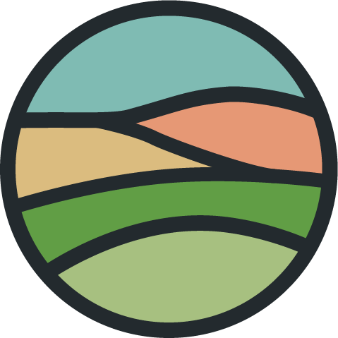

<h3 align="center">
    
  Neverglade
</h3>

<i>Calm colors for focused work.</i>

Neverglade is a calming, low-contrast colour scheme for focused work. It contains 22 colours coming in 3 flavours — Ebony, Oak, and Birch. 

Originally based on [Everforest](https://github.com/sainnhe/everforest), it aims to become community-driven but in its current state it is largely a personal project of [Emma Alexandria](https://github.com/emmalexandria).
